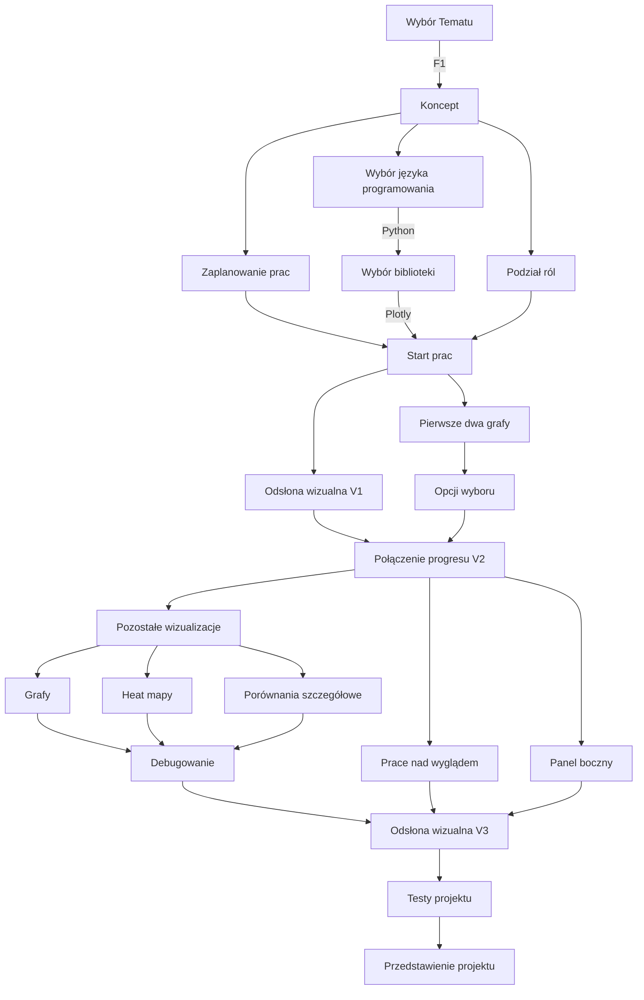

# Projekt "Formula 1 Visualized " 
> Autorzy: Tymiec, Michalinh0, WiśniaN7

## Cel projektu

Stworzenie strony internetowej które zwizualizuje 70 lat Formuły 1.

## Foldery
Sources:
 - Czysty kod z neta
 - Czyste bazy danych
 - Grafiki bazowe

Testing:
 - Testy działania Dash Plotly (Tymiec) 

 ## Roadmap

> Zaktualizowano 02.05.2022
