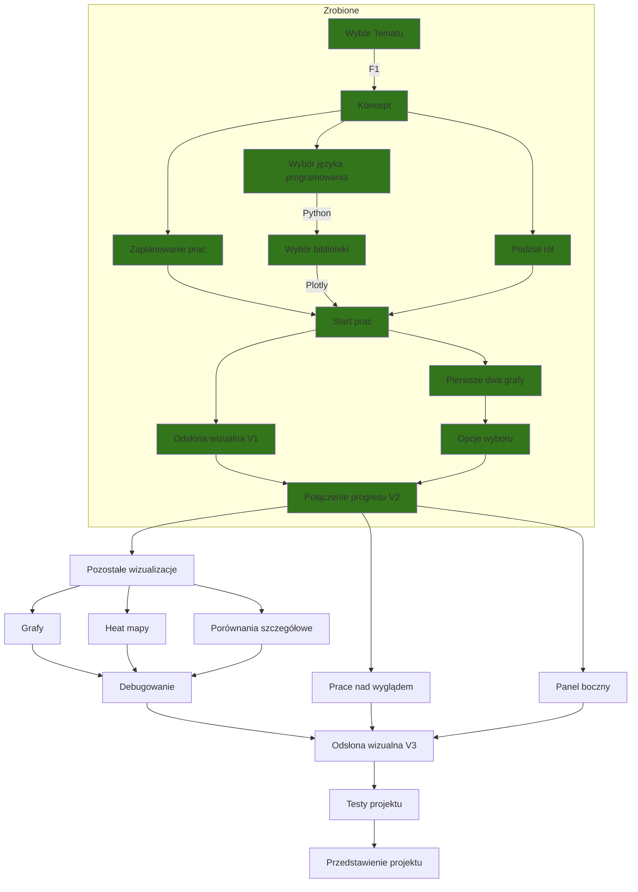

# Projekt "Formula 1 Visualized " 
> Autorzy: Tymiec, Michalinh0, WiśniaN7

## Cel projektu

Stworzenie strony internetowej które zwizualizuje 70 lat Formuły 1.

Proponowane wizualizacje:
- [x] Graf pokazujący zmiany czasów według okrążenia (lap_times_graph)
- [x] Graf pokazujący zmiany pozycji według okrążenia (position_graph)
- [X] Graf pokazujący liczbę punktów kierowców w czasie sezonu
- [X] Graf pokazujący liczbę punktów zespołu w czasie sezonu
- [ ] Animacja pokazująca pozycje na torze w czasie wyścigu
- [ ] Pit stopy na danym wyścigu
- [ ] Czasy kwalifikacji dla danego wyścigu z podziałem na Q1/Q2/Q3
- [ ] Heatmap jako mapa świata pokazujący w czasie ile wyścigów odbyło się w danym kraju
- [ ] Heatmap jako mapa świata pokazujący w czasie ile wyścigów odbyło się na danym kontynencie
- [ ] Heatmap/Graf ilości kierowców z danego kraju
- [ ] Graf/PieChart dla danego wyścigu/sezonu/całych 70 lat pokazujący statusId czyli czy ktoś skończył czy nie skończył a jeśli nie skończył to dlaczego nie skończył
- [ ] Ilość punktów zdobywana przez kierowcę co sezon
- [ ] Suma okrążeń przejechanych przez kierowcę od początku kariery i pokazywać wszystkich kierowców 
- [ ] Graf pokazujący średni wiek kierowców w danym sezonie (?)

<!-- 
Odrzucone propozycje:
- [ ] Najszybsze okrążenia na danym torze w ciągu 70 lat 
-->

## Foldery
Sources:
 - Czysty kod z neta
 - Czyste bazy danych
 - Grafiki bazowe

Testing:
 - Testy działania Dash Plotly (Tymiec) 

 ## Roadmap

> Zaktualizowano 04.05.2022
